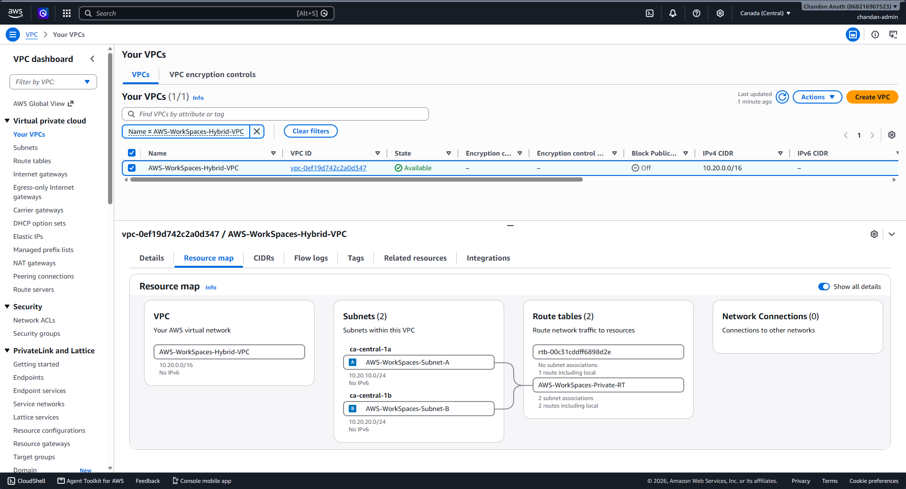
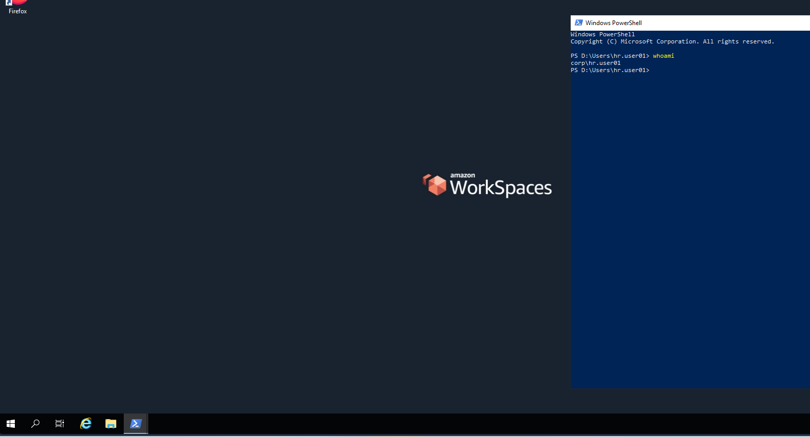

# AWS WorkSpaces – Enterprise Hybrid VDI Lab

## Project purpose

A hands-on enterprise-style Amazon WorkSpaces environment integrated with an existing on-premises Microsoft Active Directory domain.

This project is intentionally separate from the existing `Enterprise-Infrastructure-LAB` repository. The existing infrastructure repository is the source of truth for the on-premises lab; this repository documents the AWS WorkSpaces hybrid VDI extension.

## Target architecture
## Target architecture





```text
```

## Current status - 2026-09-04

**Overall: Functional hybrid network + Active AD Connector + WorkSpaces directory registered; first WorkSpace provisioning is the current step.**

| Component | Status | Notes |
|---|---|---|
| AWS CLI / IAM | ✅ Complete | `chandan-admin` used; no long-lived access key created |
| AWS VPC | ✅ Complete | `10.20.0.0/16` |
| AWS subnets | ✅ Complete | `10.20.10.0/24` and `10.20.20.0/24` |
| AWS routing | ✅ Complete | VPC route to on-prem `10.10.20.0/24` via VGW |
| Sophos VPN | ✅ Complete | Route-based XFRM VPN; Tunnel 1 is UP |
| Hybrid connectivity | ✅ Proven | DC01 successfully reached temporary AWS EC2 over VPN |
| AD preparation | ✅ Complete | `svc_adconnector` and dedicated AWS WorkSpaces OU |
| AD Connector | ✅ Active | `d-9d6749a1aa` |
| WorkSpaces directory | ✅ Registered | `CORP.AC-LAB.TOP` |
| AD user discovery | ✅ Proven | WorkSpaces retrieved 29 on-prem AD users |
| First WorkSpace | 🟡 In progress | Provision one test desktop first |
| WorkSpaces client login | ⬜ Pending | Must be tested after provisioning |
| GPO validation | ⬜ Pending | After domain-joined WorkSpace is available |
| MFA/RADIUS | ⬜ Planned | Advanced security phase |
| WorkSpaces Pools | ⬜ Planned | Advanced phase |
| Terraform / automation | ⬜ Planned | Later phase |

## Key infrastructure

### On-premises

- Domain: `CORP.AC-LAB.TOP`
- Network: `10.10.20.0/24`
- DC01: `10.10.20.20`
- DC02: `10.10.20.21`
- Sophos FW01: VLAN 20 gateway `10.10.20.1`
- FS01: `10.10.30.30`
- Hyper-V host: `HOMESERVER`
- All on-prem infrastructure in this lab is virtualized on Hyper-V.

### AWS

- Region: `ca-central-1`
- VPC: `vpc-0ef19d742c2a0d347`
- VPC CIDR: `10.20.0.0/16`
- Subnet A: `subnet-0260d48123f233e4e` / `10.20.10.0/24` / `ca-central-1a`
- Subnet B: `subnet-0d637dbe01deebf78` / `10.20.20.0/24` / `ca-central-1b`
- Virtual Private Gateway: `vgw-0d2289fef90105f01`
- Customer Gateway: `cgw-0aa72ea1065d5c765`
- VPN: `vpn-0a520b75b71fc6e41`
- AD Connector: `d-9d6749a1aa`
- AD Connector IPs: `10.20.10.103`, `10.20.20.62`

## Major troubleshooting finding

The first AD Connector deployment failed with TCP/53 DNS connectivity errors to both domain controllers.

The underlying network path was investigated using a temporary EC2 instance. The decisive finding was a **Sophos network object mismatch**:

- Actual AWS VPC: `10.20.0.0/16`
- Sophos object initially: `10.20.0.0/24`

The object was corrected to `/16`.

After the correction, DC01 successfully pinged the temporary EC2 instance at `10.20.10.221` with 4/4 replies. This proved the complete DC01 → Sophos VLAN 20 → XFRM → AWS VPN → AWS VPC path.

The temporary EC2 instance was then terminated.

## Security notes

- Never commit VPN pre-shared keys, passwords, `.pem` files, access keys, or other secrets.
- The AWS VPN configuration file uploaded during the build contains sensitive PSKs. It must not be copied into the public repository.
- The lab intentionally avoided creating long-lived IAM access keys.
- IAM Identity Center was not enabled because it was not required for this lab.
- The Sophos firewall currently has broad temporary lab rules for AWS-to-LAN/LAN-to-AWS traffic. These should be tightened during the security-hardening phase.
- VPN Tunnel 2 remains down. This is a known HA gap and is intentionally deferred.

## Cost strategy

The first WorkSpace should be kept to a single test desktop and AutoStop mode.

The current WorkSpaces wizard showed a Performance Windows Server 2022-based bundle. Do not assume that bundle qualifies for the current Standard WorkSpaces Free Tier. Verify the current AWS pricing/Free Tier terms before creating additional desktops.

## Documentation structure

```text
README.md
ROADMAP.md
docs/
├── ARCHITECTURE.md
├── AWS-RESOURCE-INVENTORY.md
├── COMMAND-LOG.md
├── DECISIONS.md
├── IMPLEMENTATION-LOG.md
├── INTERVIEW-NOTES.md
├── SCREENSHOT-INDEX.md
├── SECURITY-AND-COST.md
├── TROUBLESHOOTING.md
└── images/
    └── .gitkeep
```